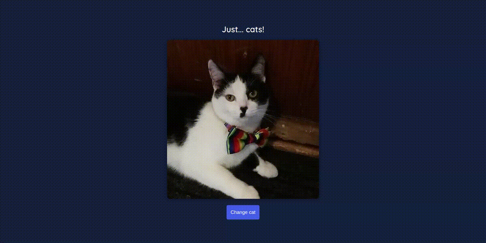

# Resultado Final

### Atividade: API "catAPI"

Nesta atividade, vamos criar uma página que carrega fotos aleatórias de gatinhos sempre que clicamos em um botão.

1. Utilize a API `https://thatcopy.pw/catapi/rest` para fazer as chamadas com o método `fetch()`;
2. Utilize seus conhecimentos na manipulação do DOM para criar a imagem e ativar o evento de clique do botão!
3. API que não deu problema: `https://api.thecatapi.com/v1/images/search`

**OBS**: Nesse code challenge, diferente do que fora explicado no código original, tive que mudar o endereço para outra API pois a usada originalmente estava dando problema com CORS. E fora utilizando uma função extra dentro para retornar a url da api. Esses foi 2 erros que me tiraram do eixo, mas com pesquisa e paciência, consegui resolver.

Hey :wave:!

